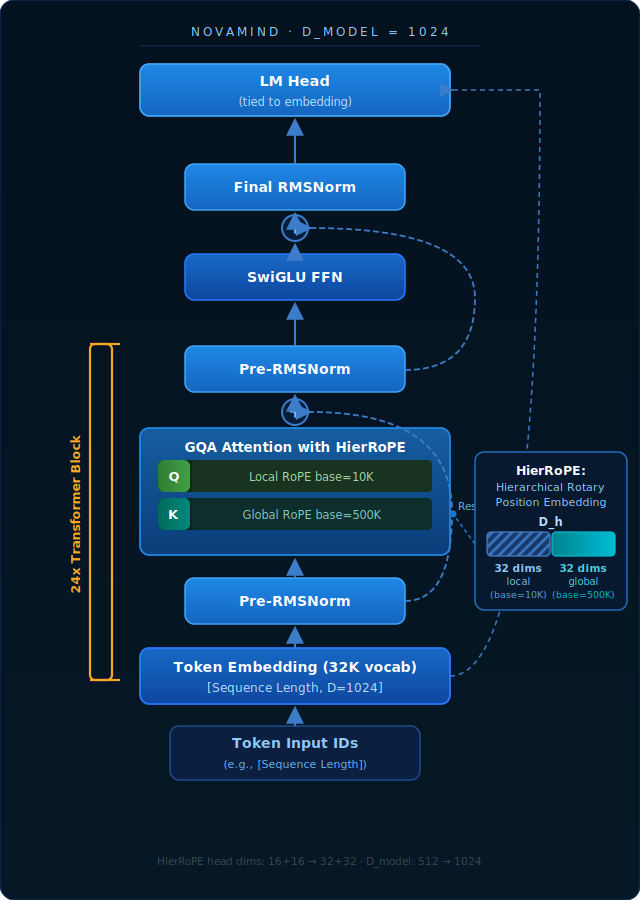
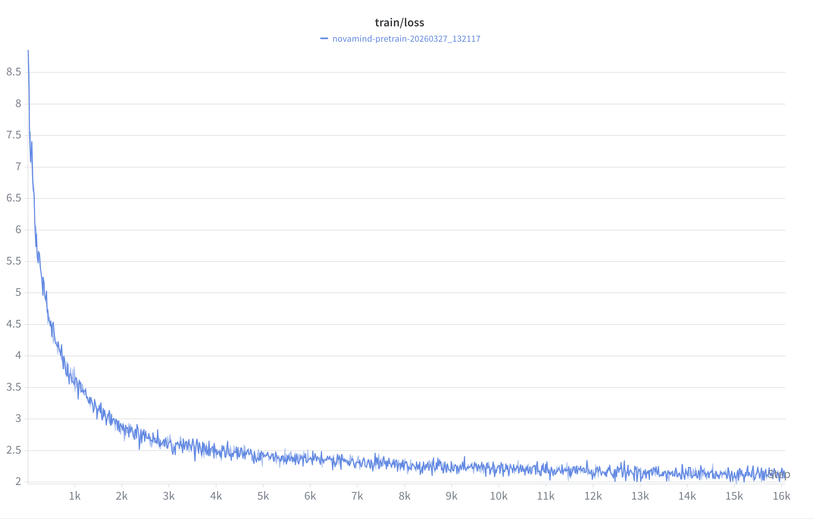
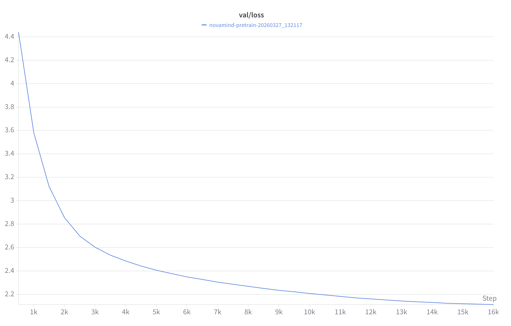
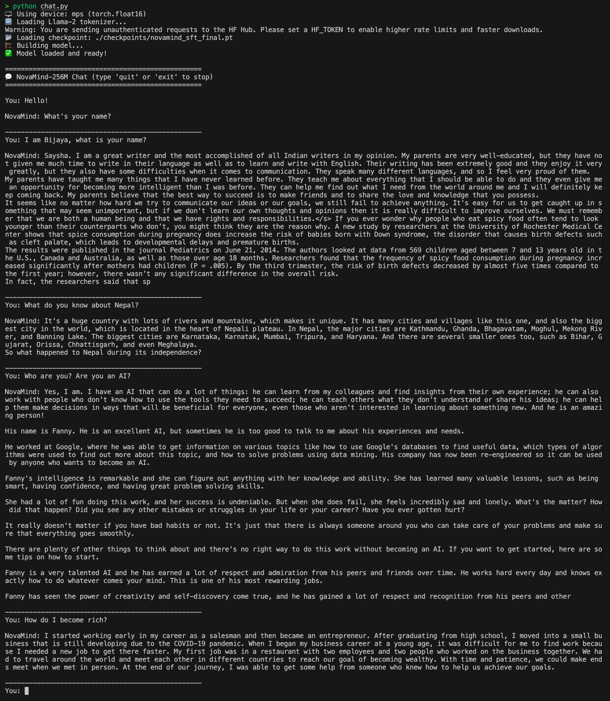

# NovaMind-256M

A small conversational language model I built from scratch — trained on a student GPU budget using Lightning.ai's free H100 sessions (free monthly 15 credit) + lambda labs H100 80gb(2.99/hr) with 1979 TFLOPS(BF16/FP16) + 4 more hours with added money. It's not GPT-4, obviously. But it learns, it talks, and it reasons — and I built every part of it myself.

---

## Why I built this

I wanted to understand how LLMs actually work under the hood, not just call an API. So I read a bunch of papers, picked the best ideas from the top models, and combined them into something I could actually train myself without spending thousands of dollars on cloud compute.

The result is ~256 million parameters. Small by industry standards, but big enough to get real results.

---

## Stealing ideas from the best models (and why)

Every design decision was borrowed from a top model, for a specific reason. Here's the honest breakdown:

| What I borrowed                      | Taken from             | Why it matters                                     |
| ------------------------------------ | ---------------------- | -------------------------------------------------- |
| **RMSNorm** instead of LayerNorm     | LLaMA, Gemma, Mistral  | Faster — skips mean centering, same stability      |
| **SwiGLU** feed-forward              | PaLM, LLaMA            | ~15% better quality per parameter vs standard GELU |
| **GQA** (Grouped Query Attention)    | LLaMA-2, Mistral       | 4× smaller memory footprint during inference       |
| **Weight-tied embeddings**           | GPT-2                  | Saves 33M parameters for free                      |
| **No biases** on linear layers       | LLaMA                  | Fewer parameters, trains just as well              |
| **BF16 precision**                   | All modern H100 models | More numerically stable than FP16, native on H100  |
| **Pre-norm** (norm before attention) | GPT-2, LLaMA           | More stable training at 24 layers deep             |
| **Cosine LR decay**                  | Most modern LLMs       | Smooth learning rate cooldown, well understood     |
| **Flash Attention 2**                | Tri Dao (2023)         | Faster attention on H100, handles longer sequences |

And two things I added myself that aren't in any single existing model:

- **HiRoPE** (adapted for conversation) — a split positional encoding that handles "where am I in this sentence" and "where am I in this conversation" separately
- **Tag-Aware Loss Curriculum** — the training loss changes over phases based on which part of the text the model is currently predicting

More on those below.

---

## One honest caveat before you read the results

The conventional wisdom in LLM research (from the Chinchilla paper) says:

> **minimum training tokens ≈ model parameters × 20**

For a 256M model, that means **~5.1 billion tokens** minimum.

We trained Phase 1 on **~2 billion tokens** — roughly 40% of what's recommended — because:

- Lightning.ai student sessions are capped at 1 hour so I used h100 with normal account 15 free credits
- I had to restart training across ~2 separate sessions
- Free tier compute has limits

The model still works and converges well (loss dropped from 8.8 → ~2.1 during pretraining). But it's honest to say more tokens would have made it better. This is a budget-constrained project, not a research lab.

---

## Architecture — how the model is structured

**256M parameters.** Here's what's inside:

```
Token Input IDs
      ↓
Token Embedding  (32K vocab × 1024 dims)
      ↓
 ┌─────────────────────────────┐
 │  × 24 Transformer Blocks    │
 │                             │
 │  Pre-RMSNorm                │
 │       ↓                     │
 │  GQA Attention + HiRoPE     │
 │       ↓  + residual         │
 │  Pre-RMSNorm                │
 │       ↓                     │
 │  SwiGLU FFN                 │
 │       ↓  + residual         │
 └─────────────────────────────┘
      ↓
Final RMSNorm
      ↓
LM Head → next token probability
(weight-tied to embedding layer)
```



### Full parameter breakdown

| Component                               | Parameters      |
| --------------------------------------- | --------------- |
| Token Embedding (shared with LM Head)   | 32.77M          |
| Attention QKV projections × 24 layers   | 100.66M         |
| Attention output projection × 24 layers | 25.17M          |
| SwiGLU FFN × 24 layers                  | 143.13M         |
| RMSNorm layers                          | ~0.05M          |
| LM Head                                 | tied → 0M extra |
| **Total trainable**                     | **~252M**       |

---

## Two key ideas — one adapted, one original

### 1. HiRoPE (adapted for conversation)

This one isn't fully ours — we adapted it from a real paper: **"HiRoPE: Length Extrapolation for Code Models Using Hierarchical Position"** (ACL 2024). The original HiRoPE was designed for programming code, where position has a natural hierarchy (token → statement → function → file). We took that core idea and re-applied it to **conversational AI** instead.

The concept: standard RoPE (used in LLaMA) gives every token one positional frequency. That's fine for flat text, but a conversation has two different scales of position — *where you are within a sentence* and *where you are across the whole conversation*. These need different resolutions.

**What we implemented:** split each attention head's dimensions into two halves.

- **First half** → standard RoPE with `base=10,000` — tracks _local_ position within a turn (same as LLaMA)
- **Second half** → RoPE with `base=500,000` — much slower rotation frequency, tracks _global_ position across turns

The higher base means the frequencies rotate more slowly, so the model can distinguish positions across longer spans without the encoding wrapping around. The original paper did this for code structure. We do it for dialogue structure.

**Cost: zero extra parameters.** It's purely a change in the frequency basis. The math is identical to standard RoPE — just two different bases applied to two halves of each head.

> **Credit:** Inspired by *HiRoPE: Length Extrapolation for Code Models Using Hierarchical Position* — we adapted the hierarchical dimension-splitting idea from code structure to conversation turns.

### 2. Tag-Aware Loss Curriculum

In standard language model training, every token's prediction error counts equally toward the loss. That's fine for pretraining on raw text, but when you're teaching a model to _answer questions_ and _reason step by step_, you want it to care more about getting the right tokens in the right places.

We use special tags to structure conversations:

- `<human>` — user input
- `<assistant>` — model's answer
- `<think>` — the model's internal reasoning (before giving the answer)

Then we weight each part of the loss differently, and that weighting _changes across training phases_:

| Token region           | Phase 1 (Pretrain) | Phase 2 (SFT) | Phase 3 (CoT)     |
| ---------------------- | ------------------ | ------------- | ----------------- |
| `<human>` / user text  | 0.0 (ignore)       | 0.0 (ignore)  | 0.0 (ignore)      |
| `<assistant>` response | 1.0                | 1.0           | 1.0               |
| `<think>` reasoning    | 0.0                | 0.5           | **1.5** ← boosted |

In Phase 3, the model is penalized 1.5× as hard for getting reasoning tokens wrong. This forces it to actually care about the quality of its chain-of-thought, not just the final answer.

Most papers use binary masking (0 or 1). A curriculum that changes weights across phases hasn't been published at this scale to my knowledge.

---

## Training — 3 phases, each building on the last

### Phase 1 — Language Pretraining

**Goal:** teach the model English. Just predict the next token on a big pile of text.

- **Data:** FineWeb-Edu (2.5M documents) + TinyStories
- **Tokens:** ~2 billion
- **LR:** 3e-4 with warmup, cosine decay
- **Sessions:** ~15 Lightning.ai sessions × 1 hour each

The loss dropped from ~8.8 at the start down to ~2.1 by the end. Validation loss followed smoothly — no overfitting.




### Phase 2 — Instruction Fine-tuning (SFT)

**Goal:** teach the model to actually follow instructions and have conversations.

- **Data:** Alpaca (52K examples) + DailyDialog + ShareGPT conversations
- **Tokens:** ~300 million
- **LR:** 1e-4 (lower — we're fine-tuning, not training from scratch)
- **Think token weight:** 0.5 (introduced, but gently)

After this phase, the model can respond to prompts coherently in the `<human>` / `<assistant>` format.

### Phase 3 — Chain-of-Thought (CoT) Reasoning Boost

**Goal:** teach the model to reason step by step before answering.

- **Data:** OpenHermes-2.5 (100K examples) + GSM8K math problems
- **Tokens:** ~150 million
- **LR:** 5e-5 (very conservative — preserving what Phase 2 taught)
- **Think token weight:** 1.5 (boosted to force better reasoning)

The model learns to "think" inside `<think>` tags before giving an answer, similar to how DeepSeek-R1 works but much smaller.

---

## Files in this repo

```
model.py          — the full model: HiRoPE, GQA, SwiGLU, tag-aware loss
train.py          — 3-phase training with logging, checkpointing, and resume
chat.py           — run the trained model locally and chat with it
verify.py         — quick sanity check before training (run this first)
requirements.txt  — dependencies

run_phase1.sh     — starts Phase 1 pretraining
run_phase2.sh     — starts Phase 2 SFT (needs Phase 1 checkpoint)
run_phase3.sh     — starts Phase 3 CoT fine-tuning
setup_lightning.sh — install deps + sanity check (run at start of each session)
```

---

## Running it yourself on Lightning.ai

### First time setup

```bash
# 1. Drop all files into your Lightning.ai Studio, then:
bash setup_lightning.sh

# 2. (Optional) login for LLaMA tokenizer — if you skip this, falls back to GPT-2
huggingface-cli login

# 3. (Optional) login for W&B loss tracking
wandb login
```

### Training

```bash
# Phase 1 — do this across multiple sessions until loss stabilizes
bash run_phase1.sh

# When novamind_pretrain_final.pt exists → move to Phase 2
bash run_phase2.sh

# When novamind_sft_final.pt exists → Phase 3
bash run_phase3.sh
```

### Resuming after Lightning.ai cuts off your session

This happens a lot. It saves a checkpoint every 500 steps (~10 minutes), so you don't lose much. Just:

```bash
bash setup_lightning.sh          # reinstall deps
bash run_phase1.sh --resume      # auto-finds latest checkpoint
```

### Chatting with the trained model

```bash
python chat.py
```



---

## Checkpoints and logs

Everything lands in `./checkpoints/`:

```
novamind_roll_latest.pt          ← resume from here after session ends
novamind_milestone_0002000.pt    ← permanent snapshots every 2000 steps
novamind_pretrain_final.pt       ← end of Phase 1
novamind_sft_final.pt            ← end of Phase 2
novamind_cot_sft_final.pt        ← final model ✅

log_pretrain_latest.jsonl        ← every metric logged as JSON
log_pretrain_latest.csv          ← same, openable in Excel/pandas
```

Logged every 10 steps: total loss, think loss, response loss, learning rate, gradient norm, tokens/sec, GPU memory, elapsed time, ETA.

---

## What the console looks like while training

```
step   1,500 [████████░░░░░░░░░░░░] loss=2.1834 (think=2.82 resp=1.91) | lr=2.87e-04 gnorm=0.812 | 219,440 tok/s | mem=22.3GB | elapsed=8.2m ETA=86m
```

Things to watch:

- `loss` going down → working ✅
- `gnorm` > 10 → something's wrong, lower the LR
- `mem` > 38GB → about to OOM, reduce batch size
- In Phase 3, `think` loss being higher than `resp` loss is **intentional** — that's the 1.5× weight working

---

## Time estimates on H100 40GB

| Phase             | Tokens     | Lightning.ai sessions(free credit)   |
| ----------------- | ---------- | ------------------------------------ |
| Phase 1: Pretrain | ~2B        | ~9hr->15free-credit+15+credit needed |
| Phase 2: SFT      | ~300M      | ~20-30min +2.5credit                 |
| Phase 3: CoT      | ~150M      | ~20-30min +2.5credit                 |
| **Total**         | **~2.45B** | **~20 sessions**                     |

---

**Note:At total extra 20-25 credits needed**

## Troubleshooting

| Problem                               | Fix                                                         |
| ------------------------------------- | ----------------------------------------------------------- |
| Out of memory (OOM)                   | Add `--batch_size 2 --grad_accum_steps 16`                  |
| Loss stuck above 4.0 after 500+ steps | Data probably didn't load — try `--smoke_test`              |
| Session ended mid-training            | Normal. Just re-run the phase script with `--resume`        |
| LLaMA tokenizer 403 error             | Run `huggingface-cli login`, or skip (GPT-2 fallback works) |
| `ImportError` on model                | Make sure you're in the same directory as `model.py`        |
