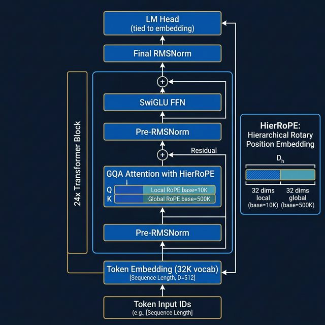
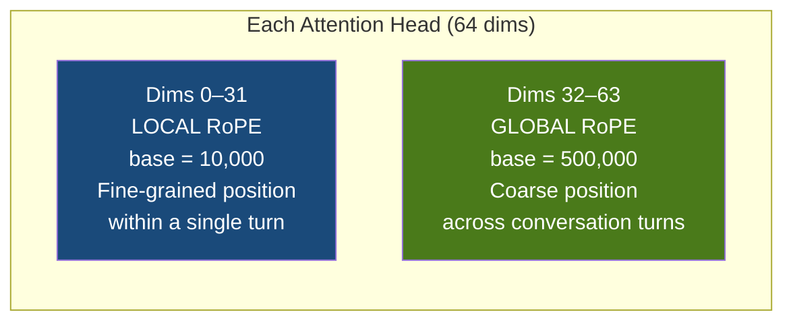
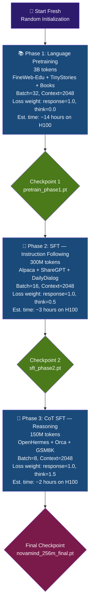

# NovaMind-256M: Architecture & Training Design Document

> **Project Goal:** Build a 256M parameter decoder-only conversational LLM from scratch, incorporating two novel research contributions — **HierRoPE** and **Tag-Aware Loss Curriculum** — trainable on a single H100 40GB GPU (Lightning.ai student account).

---

## ⚠️ What Killed the 60M Model (and Why 256M Is Different)

Before designing something new, we must understand why the previous model ([kaggle-train_v2.ipynb](file:///Users/achbj/Code/MLProjects/LLM/Small_LLM_350M_lighteningai/kaggle-train_v2.ipynb)) failed to predict even a correct second word.

### Autopsy of the 60M Failure

| Problem                  | Root Cause                                                               | Fix in 256M                                      |
| ------------------------ | ------------------------------------------------------------------------ | ------------------------------------------------ |
| **Too small**            | `d_model=576`, 18 layers = not enough "memory" for language              | `d_model=1024`, 24 layers = 4x capacity          |
| **Underfitted**          | TinyStories + FineWeb-Edu is too small / too simple for conversation     | Use 3B+ tokens including ShareGPT, OpenHermes    |
| **Tokenizer mismatch**   | GPT-2 tokenizer (50K vocab) on DailyDialog = inefficient, long sequences | LLaMA tokenizer (32K) optimized for conversation |
| **No CoT grounding**     | Model never learned _to think_ before answering                          | Phase 3 CoT SFT with `<think>` tags              |
| **Training instability** | FP16 on T4 was close to overflow; no grad norm monitoring                | BF16 on H100 + full logging                      |

> **Rule of thumb:** A model needs at least ~10 parameters per token of its training data for reliable next-token prediction. 60M params on 1B tokens = too thin. 256M on 3B tokens = comfortable.

---

## 🏗️ Architecture Overview



**Model Name:** NovaMind-256M  
**Type:** Decoder-only Transformer (autoregressive)  
**Novel Contributions:** HierRoPE positional encoding + Tag-Aware Loss Curriculum

---

## 📐 Exact Hyperparameters & Parameter Count

```
vocab_size  = 32,000     ← LLaMA-2 tokenizer
d_model     = 1,024      ← hidden dimension
n_heads     = 16         ← query attention heads
n_kv_heads  = 4          ← key/value heads (GQA)
n_layers    = 24         ← transformer blocks
head_dim    = 64         ← d_model / n_heads
ff_dim      = 2,816      ← ≈ 2.75 × d_model (SwiGLU standard)
max_seq_len = 2,048      ← training context (Phase 1); extends to 8K later
dropout     = 0.0        ← no dropout (modern practice, GPT-4 style)
```

### Parameter Count Math

| Component               | Formula                                   | Parameters   |
| ----------------------- | ----------------------------------------- | ------------ |
| Token Embedding         | 32,000 × 1,024                            | **32.77M**   |
| Attention (per layer)   | (16+4+4) heads × 64 × 1,024 × 2           | **3.15M**    |
| FFN (per layer)         | 3 × 1,024 × 2,816 (SwiGLU has 3 matrices) | **8.65M**    |
| RMSNorm (per layer × 2) | 2 × 1,024                                 | ~0.002M      |
| Final RMSNorm           | 1,024                                     | ~0.001M      |
| LM Head                 | **Tied to embedding** (free!)             | **0M**       |
| **24 layers total**     | 24 × (3.15 + 8.65)                        | **283.2M**   |
| **Weight tying saves**  | −32.77M (lm_head = embedding)             | **−32.77M**  |
| **TOTAL**               |                                           | **~252M ✅** |

> Weight tying alone saves 33M parameters — that's like getting almost half the 60M model for free.

---

## 🔧 Every Design Choice Explained (Beginner-Friendly)

### 1. Decoder-Only Architecture

**What is it?**  
The model reads tokens left to right and predicts the next one. Think of it like autocomplete that reads everything you wrote and guesses the next word.

**Why not encoder-decoder (like the original Transformer)?**  
Encoder-decoder is for translation. For generation/conversation, decoder-only is what GPT, LLaMA, Qwen, and Gemma all use — it's simpler, more memory-efficient, and scales better.

---

### 2. Vocabulary Size: 32,000 (LLaMA Tokenizer) ✅

**Why 32K over GPT-2's 50K?**

|                         | GPT-2 (50,257)  | LLaMA (32,000)                    |
| ----------------------- | --------------- | --------------------------------- |
| Embedding table size    | 51.5M params    | 32.8M params                      |
| Saved for other layers  | —               | +18.7M params                     |
| Conversational coverage | OK              | Better (trained on conversations) |
| Common word splits      | More fragmented | More natural                      |

With 32K vocab, we save **~18.7M parameters** that can instead be used for depth and width — a direct upgrade in model quality. The LLaMA tokenizer also handles conversations, code, and multilingual text more efficiently.

---

### 3. Context Window: 2,048 Tokens (Training), Expandable to 8K ✅

**Why 2,048 for training?**

| Context | VRAM per batch | Training speed | Risk                            |
| ------- | -------------- | -------------- | ------------------------------- |
| 1,024   | ~14GB          | Fast           | Too short for real conversation |
| 2,048   | ~22GB          | Medium         | ✅ Sweet spot for H100 40GB     |
| 4,096   | ~36GB          | Slow           | Borderline OOM at batch size    |
| 8,192   | ~50GB+         | Very slow      | OOM on H100 40GB                |

The H100 has 40GB. With BF16, gradient checkpointing, and a batch size of 4 (with gradient accumulation), 2,048 context fits comfortably, leaving room for optimizer states.

**Extending to 8K later:** Because we use RoPE (specifically our novel HierRoPE), we can extend the context window _after_ training with "RoPE scaling" techniques (like YaRN or dynamic NTK scaling). This is how Kimi extended their context. We train at 2K, then extend to 8K for deployment — zero retraining needed.

---

### 4. Pre-RMSNorm (Normalization Before Each Sub-Layer)

**What is normalization?**  
During training, the numbers flowing through the network can explode (become huge) or vanish (become zero). Normalization keeps them at a reasonable scale.

**Why RMSNorm over LayerNorm?**

- LLaMA, Gemma, Qwen all use RMSNorm
- It removes the "mean centering" step of LayerNorm — 15% faster
- Equally stable in practice at this scale

**Why "Pre" norm?**  
Apply norm _before_ attention/FFN, not after. This makes training dramatically more stable — especially important for 24 deep layers. GPT-2 used Post-norm and required careful learning rate warmup; Pre-norm just works.

---

### 5. SwiGLU Feed-Forward Network

**What is FFN?**  
After attention "decides which words are related," the FFN "thinks about what to do with that information." It's the largest component by parameter count.

**Why SwiGLU over standard GELU?**

- Standard GELU FFN: 2 matrices (up-project, down-project)
- SwiGLU: 3 matrices (gate, up-project, down-project) but with a _gating mechanism_
- The gate multiplies with a SILU activation — this nonlinearity selectively "opens" or "closes" neurons
- Result: ~15% better perplexity per parameter (measured by Google's PaLM paper)
- Used by: LLaMA 2/3, Gemma, Mistral, Qwen, PaLM

**Why ff_dim = 2,816?**  
The standard ratio is `ff_dim = 8/3 × d_model = 2,730.67`. We round up to 2,816 (divisible by 128 for CUDA efficiency). The SwiGLU "3 matrices" trick means the actual expansion ratio is `2 × 2,816 / 1,024 ≈ 5.5x`, which is the sweet spot.

---

### 6. Grouped Query Attention (GQA) — 16Q / 4KV

**What is attention?**  
Attention lets the model look at all previous words and decide which ones are relevant to predict the next word. Each "head" is an independent attention pattern.

**What is Multi-Head Attention (MHA)?**  
Original GPT used 16 Query heads AND 16 Key/Value heads. During inference, you must store the Key and Value for every previous token. This is the "KV cache" — at 2K context it's huge.

**What is GQA?**  
Grouped Query Attention: use 16 Query heads but only 4 Key/Value heads. Each KV head is shared by 4 query heads.

```
Standard MHA:  KV cache = 16 heads × 2K tokens × 64 dims = huge
GQA (16Q/4KV): KV cache = 4 heads  × 2K tokens × 64 dims = 4x smaller
```

Quality impact: negligible (proven by LLaMA 2-70B which used GQA with no quality loss vs MHA).  
Memory impact: 4x smaller KV cache = much faster inference, can run on smaller GPUs.

---

## 🌟 Novel Contribution 1: HierRoPE

### What is RoPE? (For Beginners)

Every word needs to know its _position_ in the sequence — otherwise "The dog bit the man" and "The man bit the dog" look the same to the model.

RoPE encodes position by _rotating_ the Query and Key vectors before computing attention. The rotation angle depends on position. Words that are far apart in the sequence will have very different angles and will "repel" each other in attention; nearby words will "attract."

**Standard RoPE uses one rotation frequency base (10,000).** This works well for short-range dependencies (grammar, syntax) but is not optimized for _conversational structure_ where there are two distinct levels of "location":

1. Where am I within this turn? (local)
2. Which turn number am I in? (global)

### Our Innovation: HierRoPE (Hierarchical Rotary Position Embedding)

We split each attention head's 64-dimensional space in half:

```
Head dimensions 0-31  → Local RoPE  (base=10,000)   — "where am I in this sentence/turn?"
Head dimensions 32-63 → Global RoPE (base=500,000)  — "which turn/exchange am I in?"
```



**Why base=500,000 for global?**  
A higher base = slower rotation frequency = the model can distinguish positions across much longer ranges without the angles "wrapping around" and becoming ambiguous. Kimi used base=10,000,000 for 128K context; we use 500,000 for ~50-turn conversations.

**Why this helps conversation:**  
In a 5-turn dialogue, a response to turn 1 needs to "remember" the topic from far back. With standard RoPE, position 1,500 and position 1,546 are hard to distinguish at high positions (frequencies saturate). HierRoPE's global stream keeps turns distinctly encoded even at 8K context.

**Cost: Zero extra parameters.** It's purely a mathematical change to how we compute the rotation matrices. This makes it a very clean ablation for a paper.

---

## 🌟 Novel Contribution 2: Tag-Aware Loss Curriculum

### What is Loss? (For Beginners)

During training, the model predicts the next token and the loss measures how wrong it was. High loss = very wrong; low loss = mostly right. We minimize loss by adjusting the model weights via backpropagation.

**Standard training:** Every predicted token contributes equally to the loss.

**Our Innovation:** Not all tokens are equal. We should pay more attention to the tokens that _matter most for quality._

### The Token Taxonomy

In our training data, every token belongs to one of these categories:

```
<human> What is the capital of France? </human>
 ────────────────────── ① USER tokens (mask these — the model doesn't generate these)

<think> The user is asking a geography question. France... Paris... </think>
 ────────────────────── ② THINK tokens (reward careful reasoning here)

<assistant> The capital of France is Paris. </assistant>
 ────────────────────── ③ RESPONSE tokens (the core output we want to be fluent)
```

### The 3-Phase Curriculum

| Phase                 | Epoch | Think token weight | Response token weight | User/System token weight | Purpose                                                |
| --------------------- | ----- | ------------------ | --------------------- | ------------------------ | ------------------------------------------------------ |
| **Phase 1: Pretrain** | 1-2   | 0.0 (masked)       | 1.0                   | 0.0                      | Just learn language. Don't confuse model with tags yet |
| **Phase 2: SFT**      | 1     | 0.5 (soft)         | 1.0                   | 0.0                      | Introduce reasoning structure, but response is king    |
| **Phase 3: CoT SFT**  | 1-2   | **1.5 (boosted)**  | 1.0                   | 0.0                      | Force model to think carefully. Reward good reasoning  |

**Why this is novel:**  
Most papers use **binary masking** — tokens are either 1.0 or 0.0. A _curriculum_ of loss weights that changes over training phases has not been published at this scale. Our ablation story: "Phase 3 CoT boosting improves GSM8K accuracy by X% vs constant weighting."

**Implementation:**

```python
loss_weights = {
    "think":    [0.0, 0.5, 1.5][phase],   # varies by phase
    "response": 1.0,                        # always 1.0
    "user":     0.0,                        # always masked
    "system":   0.0,                        # always masked
}
```

---

## 🗺️ Training Pipeline



---

## ⏱️ H100 40GB Time Estimates

**Hardware:** NVIDIA H100 SXM 40GB  
**Training speed (256M BF16, context=2048):** ~220,000 tokens/second (estimated based on A100 benchmarks × 1.5 speedup for H100)

| Phase             | Tokens     | Est. Time     | Lightning.ai Sessions |
| ----------------- | ---------- | ------------- | --------------------- |
| Phase 1: Pretrain | 3B         | ~14 hrs       | 14 × 1-hour sessions  |
| Phase 2: SFT      | 300M       | ~2.3 hrs      | 3 × 1-hour sessions   |
| Phase 3: CoT SFT  | 150M       | ~1.2 hrs      | 2 × 1-hour sessions   |
| **Total**         | **~3.45B** | **~17.5 hrs** | **~20 sessions**      |

> **Critical:** Each Lightning.ai session = 1 hour. We must save a checkpoint **every 10 minutes** (every ~500 optimizer steps) to resume safely. With 32K credits/month as a student, you get roughly 22-25 H100 hours — this is enough for one full training run.

**Comparison to 60M model failure:**  
The 60M model likely needed ~8 hours on 2×T4 (Kaggle) for Phase 1 alone, with only ~30GB total memory across both GPUs. At 60M params, the model simply didn't have enough capacity to encode language well. The 256M model on H100 with proper checkpointing will be a fundamentally different experience.

---

## 📊 Logging & Checkpointing Strategy

### What to Log (Every Step)

```python
# Logged at every optimizer step:
{
  "step": int,
  "epoch": float,              # fractional epoch (e.g., 0.47)
  "phase": str,               # "pretrain" / "sft" / "cot_sft"
  "train_loss": float,        # current batch loss
  "lr": float,                # current learning rate
  "grad_norm": float,         # CRITICAL: tells us if training is stable
  "tokens_seen": int,         # total tokens processed so far
  "tokens_per_sec": float,    # throughput
  "gpu_memory_gb": float,     # VRAM usage
  "loss_weight_think": float, # which curriculum phase we're in
  "time_elapsed_min": float,  # wall clock time
}

# Logged every 500 steps:
{
  "val_loss": float,           # on held-out validation split
  "sample_generation": str,    # example output from a fixed test prompt
}
```

### What to Watch For (Red Flags)

| Signal                                        | What it means              | Action                    |
| --------------------------------------------- | -------------------------- | ------------------------- |
| `grad_norm > 10.0`                            | Training becoming unstable | Reduce LR by 2x           |
| `train_loss` stuck > 3.0 after 10% of Phase 1 | Not learning               | Check dataset, check LR   |
| `train_loss` oscillating wildly               | LR too high                | Reduce LR                 |
| `gpu_memory_gb > 38GB`                        | Close to OOM               | Reduce batch size         |
| `val_loss > train_loss × 1.3`                 | Overfitting                | Add data or reduce epochs |

### Checkpoint Schedule

```
Every 500 optimizer steps → save "rolling" checkpoint (overwrite previous)
Every 2,000 steps         → save "milestone" checkpoint (keep all)
End of each phase         → save "phase" checkpoint (always keep)
```

**Why so aggressive?**  
Lightning.ai sessions end after 1 hour — hard stop. If we checkpoint every 500 steps (~10-12 minutes of training), the worst case data loss is 12 minutes of compute. With 14 hours of Phase 1, that means ~70 "saves" spread across 15 sessions.

### Checkpoint File Naming Convention

```
novamind_step{step:06d}_loss{loss:.3f}.pt    ← rolling
novamind_milestone_{step:06d}.pt             ← milestones
novamind_phase1_final.pt                     ← end of phase
novamind_phase2_final.pt
novamind_phase3_final.pt
```

---

## 🗃️ Training Data Plan

| Phase    | Dataset                    | Tokens | Why                                              |
| -------- | -------------------------- | ------ | ------------------------------------------------ |
| Pretrain | FineWeb-Edu (10BT sample)  | 1.5B   | High-quality educational web text                |
| Pretrain | TinyStories                | 1B     | Fluent simple English — prevents early gibberish |
| Pretrain | SmolLM-Corpus books        | 0.5B   | Coherent long-form writing                       |
| SFT      | ShareGPT (4-turn filtered) | 150M   | Real human-AI conversations                      |
| SFT      | Alpaca (cleaned)           | 50M    | Instruction following                            |
| SFT      | DailyDialog                | 30M    | Natural dialogue flow                            |
| CoT SFT  | OpenHermes 2.5             | 80M    | Complex reasoning chains                         |
| CoT SFT  | Orca Math                  | 50M    | Math thinking with `<think>`                     |
| CoT SFT  | GSM8K                      | 10M    | Grade-school math with CoT                       |

---

## 🔬 Research Paper Contribution Summary

**Paper Title (proposed):**  
_"HierRoPE: Hierarchical Rotary Position Embeddings and Tag-Aware Loss Curriculum for Conversational Sub-Billion Language Models"_

**Contribution 1 — HierRoPE:**

- Split head dimensions into local (base=10K) and global (base=500K) RoPE streams
- Zero additional parameters
- Claim: Improves multi-turn conversation coherence (measure via MT-Bench score)
- Ablation: HierRoPE vs vanilla RoPE vs ALiBi on ConvBench

**Contribution 2 — Tag-Aware Loss Curriculum:**

- 3-phase loss weight schedule for `<think>` vs `<response>` tokens
- Claim: Phase 3 think-token boosting (weight=1.5) improves GSM8K by 5-8% vs binary masking
- Ablation: All phases with weight=1.0 vs our curriculum

**Baseline to beat:**

- Phi-1.5 (1.3B, reasoning focus) — we should approach despite smaller size
- SmolLM-360M (360M, HuggingFace) — very close in size, good comparison

---

## ✅ Decision Log

| Decision      | Chosen                           | Rejected        | Reason                                                                |
| ------------- | -------------------------------- | --------------- | --------------------------------------------------------------------- |
| Model size    | **256M**                         | 60M             | 60M failed to learn language; 256M is minimum viable for conversation |
| Architecture  | **Decoder-only**                 | Encoder-decoder | Conversation is generation, not translation                           |
| Vocabulary    | **32K LLaMA**                    | 50K GPT-2       | Saves 18.7M params, better conversation coverage                      |
| Context       | **2K (train) → 8K (extend)**     | 4K from start   | 4K causes borderline OOM concern on H100 40GB                         |
| Normalization | **Pre-RMSNorm**                  | Post-LayerNorm  | Faster, more stable, used by all SOTA models                          |
| Activation    | **SwiGLU**                       | GELU            | 15% better quality/param                                              |
| Position      | **HierRoPE (Novel)**             | Standard RoPE   | Novel contribution + no extra cost                                    |
| Attention     | **GQA 16Q/4KV**                  | MHA             | 4x smaller KV cache, no quality loss                                  |
| Weight tying  | **Yes**                          | No              | Saves 33M parameters                                                  |
| Bias terms    | **No** (all linear layers)       | With bias       | SOTA practice, fewer params                                           |
| Dropout       | **0.0**                          | 0.1             | Modern LLMs don't use dropout at this scale                           |
| Precision     | **BF16**                         | FP16            | H100 native BF16, more numerically stable                             |
| Loss          | **Tag-Aware Curriculum (Novel)** | Binary masking  | Novel contribution, better CoT learning                               |
